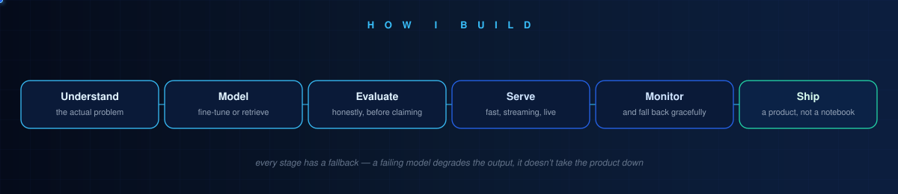

<div align="center">



<br/>


<br/><br/>

<a href="https://www.linkedin.com/in/ghazouani-wala-eddine"></a>
<a href="https://huggingface.co/Ghazouaniwala"></a>
<a href="mailto:walaghazouani.work@gmail.com"></a>
<a href="https://github.com/GhwazouaniWala"></a>
<a href="https://www.upwork.com/freelancers/~walaghazouani"></a>

<br/>


</div>

<div align="center">


<sub>**— Wala Eddine Ghazouani**</sub>

</div>


## `>` whoami

I'm **Wala Eddine Ghazouani** — a final-year Data Science engineering student at **ESPRIT**, building AI systems end to end: from the fine-tune, through the retrieval layer and the serving path, to a deployed application with a latency budget and monitoring on it. Not notebooks that worked once.

```yaml
name:        Wala Eddine Ghazouani
role:        AI / ML Engineer
specialise:  [ LLMs, RAG, multimodal, agentic systems, computer vision, MLOps ]
publishes:   huggingface.co/Ghazouaniwala
```

**What I've done so far** — two internships at **Wevioo**, a digital-transformation consultancy working across 30+ countries, the second focused on production multimodal AI. **Project lead** of a six-person multi-agent platform delivered with industry partner **VALUE**. Two fine-tuned speech models published on **Hugging Face**. Freelance AI work on **Upwork** building **agentic systems and workflow automation** for international clients, from scoping through deployment and handover.

<div align="center">



</div>

### AI capabilities I've worked in

| Area | What I've done with it |
|---|---|
| **Model fine-tuning** | Adapted pretrained speech models to new tasks and a new language, and published both. Includes the evaluation design — measuring on unseen speakers, not an easier split. |
| **Retrieval-Augmented Generation** | Built retrieval layers over clinical literature, product catalogues, financial news and UX research, so answers come from real sources instead of the model's guess. |
| **Agentic AI** | Built agents that plan, call tools and act over multiple steps, with orchestration deciding what runs, in what order, and what happens on failure. |
| **Multi-agent systems** | Designed agents that analyse a problem from independent angles, then coordinated them — including the logic for what to do when they disagree. |
| **AI workflow automation** | Replaced manual processes end to end: data captured, understood and turned into a finished record or decision without a person in the middle. |
| **Computer vision** | Image classification, quality assessment, facial analysis and document recognition, deployed to run fast enough for live use. |
| **Speech & audio AI** | Speech-to-text, text-to-speech, and emotion recognition from vocal tone alone. |
| **Multimodal AI** | Combining vision, audio and text signals into one decision, keeping the channels separate so conflicts between them stay visible. |
| **NLP** | Sentiment analysis, image captioning, text classification, and multilingual processing across three languages. |
| **Model deployment** | Taking models out of notebooks: optimised runtimes, streaming responses, real-time connections, and APIs other systems can call. |
| **MLOps** | Experiment tracking, monitoring, containerised training and serving, and reproducible pipelines. |
| **Evaluation** | Deciding what "good" means before claiming it — honest test design, confidence thresholds, and backtesting. |


## `>` roles I'm targeting

<div align="center">


<br/>


<br/>


<br/>


</div>


## `>` stack

<div align="center">

**Generative AI · LLMs**


**Agents · Orchestration · RAG**


**Vision · Speech · Multimodal**


**ML · Data**


**Serving · Backend**


**MLOps · Infra**


**Interfaces**


</div>


## `>` published models

<div align="center">

| Model | What it is | |
|---|---|---|
| **`emotions_speech`** | wav2vec2-large-XLSR-53 fine-tune — 7-class speech emotion, evaluated **speaker-independently** with `GroupKFold`, not the leaky random split that inflates every number you've seen | [](https://huggingface.co/Ghazouaniwala/emotions_speech) |
| **`silma-tts-derja`** | F5-TTS fine-tune for **Tunisian Derja** speech synthesis — every off-the-shelf Arabic TTS outputs MSA, a register nobody actually speaks | [](https://huggingface.co/Ghazouaniwala/silma-tts-derja) |

</div>


## `>` featured work

### 🧠 [Solace](https://github.com/GhwazouaniWala/solace) — real-time multimodal AI coach

> Two emotion classifiers run on you *concurrently* — facial expression (EfficientNet-B0, ONNX) and vocal tone (fine-tuned wav2vec2-XLSR-53) — and the **disagreement between channels is surfaced, not averaged away**, because a user whose wording reads `neutral` while their voice reads `fearful` is the single most useful thing the system can notice. Answers stream back over full-duplex WebSocket, grounded in RAG across **603 clinical documents** and cited by named technique. Follows your language per turn — switch mid-session and the next reply comes back in the new one, voice included.

<table>
<tr>
<td width="50%"><br/><sub><b>Voice mode</b> — orb driven by live FFT of the audio stream</sub></td>
<td width="50%"><br/><sub><b>Session report</b> — every metric labelled <code>Measured</code> vs <code>Model estimate</code></sub></td>
</tr>
</table>

      

---

### 📈 [FX AlphaLab](https://github.com/GhwazouaniWala/fx-alphalabs) — multi-agent financial intelligence

> **Project lead, 6 engineers, 5 months**, delivered with industry partner VALUE. Technical, macro and sentiment agents analyse the market independently, then pass through an orchestrator and a **conviction gate that exists specifically to suppress signals the agents disagree on**. Unified feature matrix of **204k+ rows spanning 2015–2025**. I owned the macro agent end to end — ingestion, feature engineering, regime detection, training, orchestration — and set up the MLOps layer.

<table>
<tr>
<td width="50%"><br/><sub><b>Signals</b> — per-analyst reasoning, conviction, risk parameters</sub></td>
<td width="50%"><br/><sub><b>Backtesting</b> — win rate, profit factor, drawdown, Sharpe</sub></td>
</tr>
</table>

      

---

### 🔎 [Critiq](https://github.com/GhwazouaniWala/critiq) — agentic UX & conversion audit

> A **LangGraph `StateGraph`** fans specialist agents out with `Send()` and a custom state reducer. Every dimension sits behind a confidence gate with a deterministic heuristic fallback, so **the report always ships** with per-dimension honesty about which score is which. Weights adapt to site type — a trust badge matters more on an ecommerce checkout than a portfolio. Hybrid Playwright + Firecrawl scraping runs under one `asyncio.gather`, so wall time is `max()`, not the sum.

<table>
<tr>
<td width="50%"><br/><sub><b>14-dimension radar</b> — real run against stripe.com, 88/100</sub></td>
<td width="50%"><br/><sub><b>Top fixes</b> — ranked by weight × deficit, each with DOM evidence</sub></td>
</tr>
</table>

     

---

<table>
<tr>
<td width="50%" valign="top">

### 🛒 [NeuraShop](https://github.com/GhwazouaniWala/neurashop)
**Accessible AI marketplace**

Six deep-learning modules fire at the moment of upload so no seller fills in a form: auto-categorisation (**97.4% F1**, 14 classes — my module), WCAG-validated alt-text via BLIP so screen-reader users aren't locked out, a photo-quality gate with CNN enhancer fallback, aspect-based review sentiment, visual recommendations, and a RAG shopping assistant.

    

</td>
<td width="50%" valign="top">

### 📄 [Wathika](https://github.com/GhwazouaniWala/wathika-ocr)
**Offline Arabic document intelligence**

Handwritten Tunisian legal forms → structured, searchable client records, **entirely offline** — privileged client data under Tunisia's INPDP regime cannot go to a cloud OCR API. Template matching locates each field; per-field recognisers handle handwritten Arabic, numerals, checkboxes, signatures. Human corrections are retained as labelled training data.

    

</td>
</tr>
</table>

<div align="center">
<a href="https://github.com/GhwazouaniWala?tab=repositories"></a>
</div>


## `>` experience

```
2026 · Jun–Aug   AI Engineering Intern — Wevioo
                 Solace: full-duplex voice, concurrent face + voice emotion
                 classifiers, RAG over 603 clinical docs. 2 models to HF.

2026 · Feb–Jun   Project Lead — FX AlphaLab (ESPRIT × VALUE)
                 6 engineers, 5 months. Owned the macro agent end to end.
                 Built the MLOps layer: split images, MLflow, Prometheus.

2025 · Jul–Aug   Software Engineering Intern — Wevioo
                 MeetSummary: Graph OAuth 2.0, OneDrive discovery, Whisper,
                 LLM summarisation, PDF export. Solo, 3 Scrum sprints, 18 stories.

2025 · Present   AI Engineer (Freelance) — Upwork
                 RAG chatbots, Python agents, scraping→structured pipelines.
                 Scoping through deployment, integration and handover.
```


## `>` certifications

<div align="center">

<table>
<tr>
<td width="58%" valign="top">

### 🧠 LLM Engineering in Practice

**Provider** &nbsp;·&nbsp; 365 Data Science
**Issued** &nbsp;·&nbsp; March 2026
**Credential ID** &nbsp;·&nbsp; `CC-D474221DCF`

Building and deploying an LLM application end to end — prompt design, the OpenAI API, and shipping it behind a real interface rather than leaving it in a notebook.

</td>
<td width="42%" align="center" valign="middle">

<br/>

<a href="https://learn.365datascience.com/c/7075d10c57"></a>

</td>
</tr>

<tr>
<td width="58%" valign="top">

### ⚡ Fundamentals of Deep Learning

**Provider** &nbsp;·&nbsp; NVIDIA Deep Learning Institute
**Issued** &nbsp;·&nbsp; January 2026
**Credential ID** &nbsp;·&nbsp; `1tO0Ys3ITkGJkXM3sgBKrQ`

Training neural networks on GPU from first principles — backpropagation, CNN architectures, augmentation, transfer learning, and what actually makes training converge.

</td>
<td width="42%" align="center" valign="middle">

<br/>

<a href="https://learn.nvidia.com/certificates"></a>

</td>
</tr>

<tr>
<td width="58%" valign="top">

### 🤖 Building AI Agents with Multimodal Models

**Provider** &nbsp;·&nbsp; NVIDIA Deep Learning Institute
**Issued** &nbsp;·&nbsp; January 2025
**Credential ID** &nbsp;·&nbsp; `F2g-DA5JToWxYr22V1Y7Tg`

Composing vision-language models into agents that plan and act across modalities — the foundation under the multi-channel fusion work in my own systems.

</td>
<td width="42%" align="center" valign="middle">

<br/>

<a href="https://learn.nvidia.com/certificates?id=JOcvsCL5R_COA2qjS-_V1Q"></a>

</td>
</tr>

<tr>
<td width="58%" valign="top">

### 🎨 Generative AI with Diffusion Models

**Provider** &nbsp;·&nbsp; NVIDIA Deep Learning Institute
**Issued** &nbsp;·&nbsp; January 2025
**Credential ID** &nbsp;·&nbsp; `TauXuWfURMOBYNutOVkopw`

The denoising diffusion process from noise scheduling through sampling — how modern image and audio generation works underneath, not just how to call it.

</td>
<td width="42%" align="center" valign="middle">

<br/>

<a href="https://learn.nvidia.com/certificates?id=-5GEyfimSQme_gwlTRSCsw"></a>

</td>
</tr>

<tr>
<td width="58%" valign="top">

### 👁 Convolutional Neural Networks with TensorFlow

**Provider** &nbsp;·&nbsp; 365 Data Science
**Issued** &nbsp;·&nbsp; November 2025
**Credential ID** &nbsp;·&nbsp; `CC-C804599CCC`

CNN architecture design and image classification — the vision groundwork underneath the classifiers running in my production systems.

</td>
<td width="42%" align="center" valign="middle">

<br/>

<a href="https://learn.365datascience.com/c/b7907b56fe"></a>

</td>
</tr>
</table>

<br/>


</div>


## `>` how I work

**I build things that stay up.** Every system I ship has a fallback path, so a failing model or a dead API degrades the output instead of taking the product down.

**I don't inflate results.** Reported numbers say how they were measured, and the system marks what it couldn't observe rather than guessing a value.

**I write down what's broken.** Every repo lists its own known limitations. Knowing where a system falls short is part of having built it.

**I finish things.** Each project below is a working application with a real interface — not a model in a notebook.


## `>` what I'm learning next

Currently studying, not yet shipped — listed separately from my project work on purpose.

| | |
|---|---|
| **Cloud AI infrastructure** | Running models on managed cloud rather than one machine — GPU instance selection, autoscaling inference endpoints, and what changes about a serving path once it leaves localhost. |
| **LLMOps** | Prompt and model versioning, tracing a multi-step agent run end to end, token and cost budgeting, and rolling out a prompt change safely. |
| **Agent evaluation** | Eval harnesses for agents where correctness isn't one label — trajectory scoring, LLM-as-judge reliability, and regression suites that catch silent degradation. |
| **Inference optimisation** | Quantisation, KV-cache behaviour, and batching for throughput on vLLM. |
| **Preference tuning** | DPO and reward modelling — aligning a model to preferences, beyond supervised fine-tuning. |
| **Model Context Protocol** | Standardised tool interfaces so agents connect to external systems consistently. |
| **Small & on-device models** | Distillation and compact architectures for cases where a large hosted model is the wrong answer. |

<div align="center">


</div>


## `>` the trajectory

```
2023  ├─  Foundations — algorithms, databases, software engineering
      │
2024  ├─  Machine learning · deep learning · computer vision
      │
2025  ├─  First engineering internship — shipped a production application solo
      │   Freelance AI work begins: client RAG systems and agents
      │
2026  ├─  Project lead, six-person multi-agent platform with an industry partner
      │   Second internship — multimodal AI, two models published
      │
2027  └─  Final-year internship  →  AI Engineer
```


## `>` how I build

<div align="center">



</div>


## `>` toolbelt

<div align="center">


<br/>


</div>


<div align="center">

## `>` contact me about an internship


<br/>

<a href="mailto:walaghazouani.work@gmail.com"></a>
<a href="https://www.linkedin.com/in/ghazouani-wala-eddine"></a>
<a href="https://huggingface.co/Ghazouaniwala"></a>

<br/><br/>


</div>
